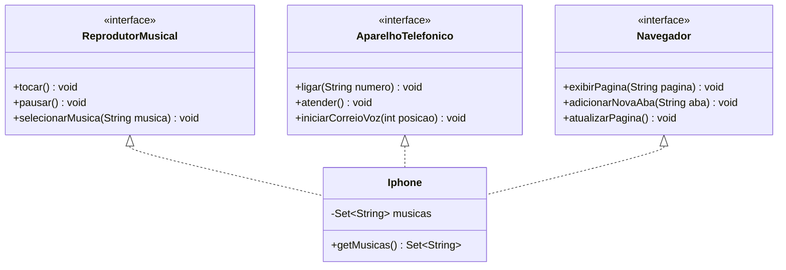

# Modelagem e diagramação da representação em UML e código no que se refere ao componente Iphone 

# Sobre o projeto
Este projeto tem por objetivo desenvolver um protótipo simples do Iphone utilizando os conceitos de POO, para tanto foi necessária a modelagem e diagramação da representação do IPhone em UML

# Diagrama de classes UML

# Tecnologias utilizadas 
  - Java JDK 17
  - IntelliJ IDEA

# Como executar o projeto
Pré-requisitos: Java JDK 17

# Autor
Matheus Fernando Vieira Pinto.

https://www.linkedin.com/in/matheus-vieira-06166722a/
